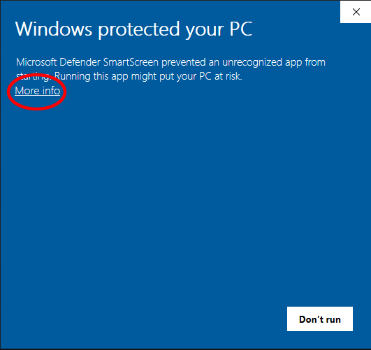

# L2JChat README

## Purpose
This application is meant to supplement non-Japanese client versions of L2 - allowing users to type/communicate in Japanese without taking away from their game experience.

## Requirements 
Windows
.Net 6 Framework (will be installed automatically during setup)

## Installation
Use this [setup.exe](https://github.com/MoetsukiOtoko/L2JChat/blob/master/published/setup.exe?raw=true) located within this repository.
The application is not certified with Microsoft SmartScreen so it will produce this warning. 

Please feel free to run it, as well as all installed files, through https://www.virustotal.com/gui/home/upload. Or simply look through the source code yourself as it is all included in this repository.

## Usage

#### Connecting
Connection information can be found on the discord: https://discord.gg/JvUzYnph62.

#### Updating
This application is deployed with ClickOnce. When the application is launched, if there is an update available, the user will be prompted to update automatically. All source code for updates will be available in this repository. 

## Moving forward
Please report bugs/give feedback via the discord. I will make a roadmap for future updates.

## Changelog